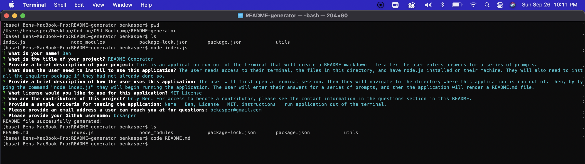

# README Generator
  ### Created by: Ben Kasper

  ## Description
  This is an application run out of the terminal that will create a README markdown file after the user enters answers for a series of prompts.

  ## Table of Contents
  - [Installation](#installation)
  - [Application Usage](#usage)
  - [License](#license)
  - [Contributors](#contributors)
  - [Tests](#tests)
  - [Questions](#questions)

  ## Installation
  The user needs access to their terminal, the files in this directory, and have node.js installed on their machine. They will also need to install the inquirer package if they had not already done so.

  ## Usage
  This program runs entirely out of the terminal. To run it: 
  
  1. The user will first open a terminal session. 
  2. Then they will navigate to the directory where this application is run out of. 
  3. Then, by typing the command "node index.js" they will begin running the application. 
  4. The user will enter their answers for a series of prompts, and then the application will render a README.md file.
  5. The README will include all the sections the user entered inputs for, as well as automatically creating a table of contents.
  6. As a note, if the user does not choose a license (or chooses "None"), there will be no license section.

  ## Demo screenshot
  

  ## Tests
  Feel free to use this sample input data to test the application:

  - Name: Kermit the Frog
  - Project Name: README Generator
  - Description: This is an application to create a README
  - Usage needs: Node.js, npm Inquirer, a Terminal, VS Code, Github account
  - How to use: Follow prompts after running "node index.js" in the directory where the application is stored
  - License: MIT License
  - Contributors: Kermit the Frog and Miss Piggy
  - Email: noteasybeinggreen@gmail.com
  - Github: Greenfroggy

  ## Questions
  Questions? Please visit my Github to view code and/or send me a message at https://github.com/bckasper
